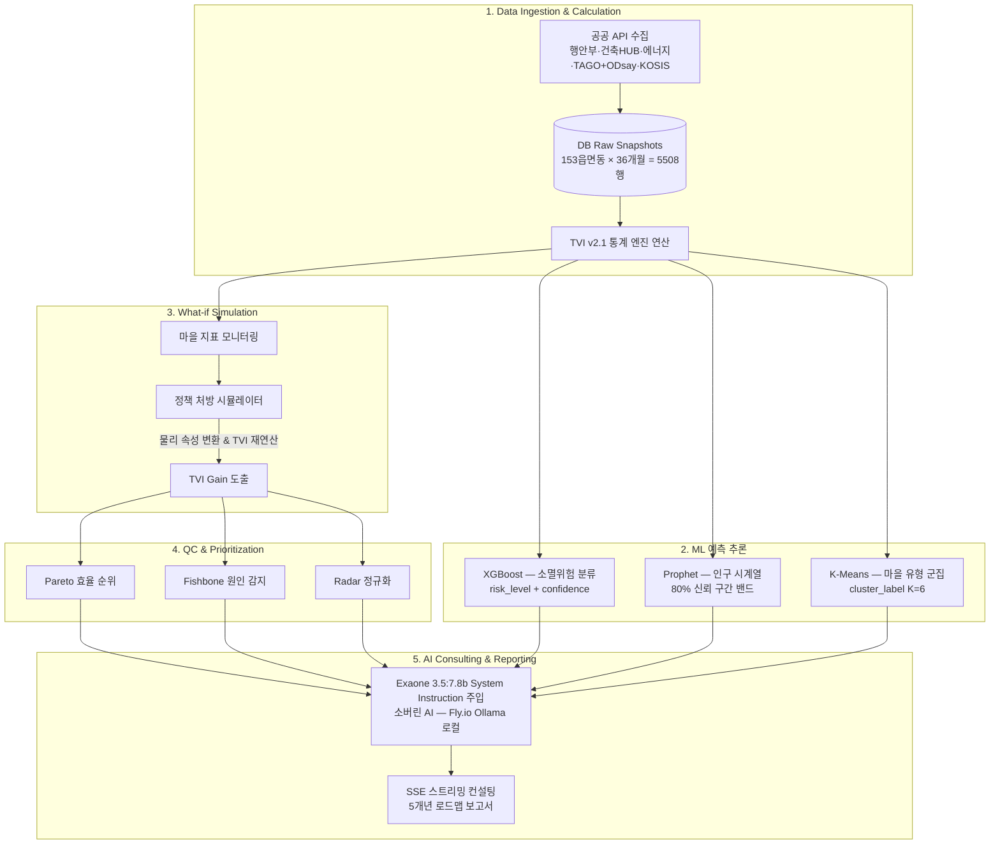

# 지능형 의사결정 파이프라인
{: .no_toc }

수치 계산 엔진(ML·정량 통계)과 생성형 언어 모델(LLM·정성 분석)이 분리되지 않고 하나의 유기적 파이프라인으로 결합됩니다.

1. **정량 TVI 산출** — 원천 DB 기반 현재 건강 상태(TVI + 4대 지표) 즉시 평가·시각화.
2. **What-if 개입** — 공무원이 예산을 바꾸면(예: "DRT 1억 증액") 백엔드가 가상 스냅샷(`VillageSnapBundle`)을 임시 생성, 수식 엔진 재구동으로 **TVI Gain 실시간 계산**.
3. **QC 우선순위** — **파레토**로 누적 기여도 85% 달성 최우선 과제(`is_core_priority`) 선발, **피시본**으로 부문별 하락 요인 진단, **레이더**로 시계열 추이 정규화.
4. **AI 컨설턴트** — 답변 직전 TVI Gain 범위·국지비 분담·우선순위 코드·약화 항목을 `system_instruction`으로 주입 → Exaone이 환각 없이 5개년 로드맵 보고서(JSON) 빌드.
