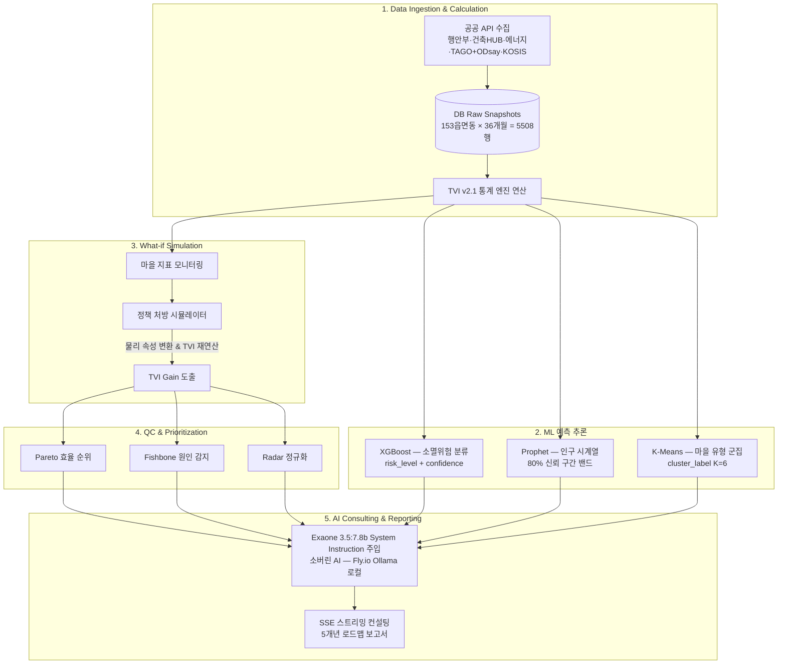

<!--
  TownPulse 프로젝트 사이트 — Jekyll (Just the Docs) 단일 소스 페이지
  참고 사이트: https://beyondfacade.github.io/metabole.beyondfacade.cloud/ (같은 팀·같은 맥락)
  출처 문서: vault/사업계획서/ (사업정의서 v8.2 · 전략분석 v7.2 · TVI점수분석 · tech_description
             · Workflow · API필드 · 문제인식 · 팀프로필) + vault/backend·frontend 아키텍처 문서
  본 파일 하나로 Jekyll 사이트를 빌드하므로 각 섹션은 그대로 페이지로 분리 가능하도록 구성.
  mermaid 다이어그램 사용 → _config.yml 에서 `mermaid` 활성화 필요.
-->

# TownPulse
{: .fs-9 }

## 충북 마을생존 AI 의사결정 플랫폼
{: .fs-6 .fw-300 }

빈집 증가 → 인구 소멸 → 교통 공백이라는 **악순환 고리**를 하나의 플랫폼에서 실시간으로 감지합니다.
충청북도 **153개 읍·면·동**을 19종 공공데이터와 ML 5종 모델로 추적하고,
**소버린 AI(Exaone 3.5:7.8b 로컬)**가 지자체 담당자에게 *"어느 마을을 먼저, 어떤 처방으로, 얼마의 예산으로"* 대응할지
근거 있는 행정 처방과 예산 시뮬레이션을 제공합니다.

[지도에서 진단하기](https://townpulse.site){: .btn .btn-primary .fs-5 .mb-4 .mb-md-0 .mr-2 }
[문서 목차로 이동](#목차){: .btn .fs-5 .mb-4 .mb-md-0 }

> 2026 충청북도 공공데이터·AI 활용 창업경진대회 · 제품 및 서비스 개발 분야 · 팀 **Pulse Lab**

---

## 핵심 지표

<div class="metrics" markdown="1">

- **153개** · 충북 전 읍·면·동 (방안 B — "리" 단위 배제)
- **19종** · 공공 API 전량 승인·probe 검증 완료 (2026-06-19 ~ 2028-06-19)
- **5,508행** · 실데이터 (153마을 × 36개월, 2023-01 ~ 2025-12)
- **ML 5종** · XGBoost · Prophet · K-Means · Ridge 훈련 완료
- **34개 도메인 · 25개 테이블** · 헥사고날 11-File 프랙탈
- **11개 시군구** · TAGO + ODsay 이중화로 교통 실데이터 100% 커버

</div>

---

## 세 가지 축

<div class="features" markdown="1">

### 📊 데이터 엔지니어링
행안부·국토교통부·통계청·소상공인공단·국립중앙의료원·KERIS 등 **19종 공공 API**를 통합 수집합니다.
시군구 단위 캐싱 · `asyncio.gather` + `Semaphore` 병렬 호출(건축HUB 20 / 에너지 10) · Monthly Snapshot Skip으로
쿼타를 절약하고, `hashlib`·`random` 등 **가짜 데이터의 DB 삽입을 전면 금지**합니다.

### 🧮 TVI v2.1 · 소버린 AI
인구(35%)·빈집(15%)·교통(20%)·인프라(30%) 4대 부문과 **5대 동적 시나리오**로 마을생존지수를 0~100점 산출.
행정·전력·통계·실거래 **4중 교차검증**으로 실질 빈집율을 잡고, **Exaone 3.5:7.8b(Ollama 로컬)**가
예산 범위·기금 출처를 환각 없이 인용한 처방 컨설팅을 SSE로 스트리밍합니다.

### 🏛️ 헥사고날 프랙탈 아키텍처
모듈러 모놀리스 위에 헥사고날(Ports & Adapters) + 클린 아키텍처 + DDD를 채택.
도메인마다 11개 파일을 1:1 매칭하는 **프랙탈 구조**로 AI 하네스 엔지니어링을 극대화하고,
경계 톨게이트(mapper·orm_mapper)로 도메인 순수성을 지킵니다. 충북→전국 어댑터 교체만으로 확장 가능.

</div>

---

## 팀 — Pulse Lab

팀원 전원이 백엔드(FastAPI)·프론트엔드(Next.js)를 함께 개발한 **풀스택 체제**이며, 아래는 각자 집중한 파트입니다.

### 김충식 — 팀장 · PM · 아키텍처 총괄
34개 도메인 헥사고날 아키텍처를 **13차례(v1.0→v9.5) 버전 진화**시키며 설계·문서화를 총괄했습니다.
공공 API 19종 검증과 LLM 할루시네이션 방지 구조(**서버 측 context 조립**)를 설계했습니다.
정부 공모사업 선정·집행 실전 경험(초기창업패키지 1억 원 집행, 농식품 벤처육성 2천만 원)과
매출 9억→91억 견인(2020~2024), 국가기술자격 **식품기술사**, HACCP·ISO22000 인증 직접 획득 이력을 보유합니다.

### 이은상 — 풀스택 · QA
FastAPI + Next.js 공동 개발. **게임회사 QA 8년 경력**으로 ERD 정합성 오류, 예산 단가 할루시네이션(**최대 22배 오차**),
호출 불가 공공 API 3종을 전수 검증으로 탐지·교정했습니다. "기획서와 구현이 다를 때 탐지하는" QA 역량이
"실정책과 코드 수치가 다를 때 탐지하는" 역량으로 직결됐습니다.

### 신채연 — 풀스택 · 해외 전략
행정구역 폴리곤 **19개→153개 완전 복원**, ML 예측 결과 시각화(XGBoost·Prophet·K-Means 배지),
응답 지연을 신뢰감으로 전환하는 **소버린 AI UX 설계**, 공문서급 PDF 리포트를 구현했습니다.
한영외고 일본어과 · 이화여대 영어영문+일본언어문화 복수전공 · **JLPT N1**, 저서 『공정무역 할 것인가 승자독식 할 것인가』 대표저자.

---

## 프로젝트 정보

| 항목 | 내용 |
|------|------|
| **서비스명 / 팀명** | TownPulse / Pulse Lab |
| **대상 지역** | 충청북도 153개 읍·면·동 (11개 시군) |
| **핵심 산출물** | 마을생존지수(TVI v2.1) · 소버린 AI 5개년 정책 처방 · 예산 시뮬레이션 |
| **백엔드** | FastAPI · SQLAlchemy 2.0(Async) · asyncpg · NeonDB · Alembic |
| **프론트엔드** | Next.js 14 · TypeScript · Tailwind · Leaflet · Recharts · Zustand |
| **AI 엔진** | LG Exaone 3.5:7.8b (Ollama 로컬 · 소버린 AI) · Kiwi 형태소 토크나이저 |
| **ML** | scikit-learn · XGBoost · Prophet (분류·회귀·시계열·K-Means·Ridge) |
| **배포** | Vercel(`townpulse.site`) ↔ Fly.io(`api.townpulse.site`) ↔ NeonDB |

---

## 목차

1. [문제 인식 — 소멸의 악순환](#1-문제-인식--소멸의-악순환)
2. [솔루션 개요와 차별성 (내마을AI 대응)](#2-솔루션-개요와-차별성)
3. [공공데이터 활용 — 19종 API](#3-공공데이터-활용--19종-api)
4. [TVI v2.1 산출 방법론](#4-tvi-v21-산출-방법론)
5. [ML 5종 추론 모델](#5-ml-5종-추론-모델)
6. [예산 시뮬레이션 구조](#6-예산-시뮬레이션-구조)
7. [지능형 의사결정 파이프라인](#7-지능형-의사결정-파이프라인)
8. [AI·백엔드 기술 구조](#8-ai백엔드-기술-구조)
9. [프론트엔드 & 사용자 워크플로우](#9-프론트엔드--사용자-워크플로우)
10. [ERD & 데이터 흐름](#10-erd--데이터-흐름)
11. [전략 분석 — SWOT · STP](#11-전략-분석--swot--stp)
12. [비즈니스 모델 & 로드맵](#12-비즈니스-모델--로드맵)
13. [ESG 혁신 가치](#13-esg-혁신-가치)
14. [핵심 기술 내역 요약](#14-핵심-기술-내역-요약)

---

## 1. 문제 인식 — 소멸의 악순환

충청북도는 11개 시군 중 **6곳(제천·보은·옥천·영동·괴산·단양)이 행정안전부 인구감소지역**으로 지정될 만큼 소멸 위기가 심각합니다. 농촌 지역을 중심으로 세 문제가 **하나의 인과관계 사슬**로 동시에 진행됩니다.

```
빈집 증가
  → 마을 소멸 가속
    → 버스 노선 축소
      → 남은 주민 고립
        → 더 빠른 소멸 (악순환)
```

| 문제 | 현황 | 기존 대응의 한계 |
|---|---|---|
| **빈집 급증** | 주택총조사 기준 빈집 비율 10.4%(2022, 전국 7.6%) — 부동산원 행정조사는 2,401채로 정의별 편차 큼 | 부서별 수작업, 정의별 수치 상충, 실시간 파악 불가 |
| **인구 소멸** | 6개 시군 인구감소지역 지정, 153개 읍면동 상당수 소멸위험 진입 | 현황 파악만 가능, 예측·처방 부재 |
| **교통 공백** | 농촌 버스 노선 지속 감축 | 수요-공급 불일치, 취약계층 이동권 침해 |

**현장 실증 사례 (충북)**

- **단양군** — 3개 초등학교(가곡초 대교분교·보발분교, 영춘초 별방분교) 신입생 **0명**, 학교 유지 자체가 불가능 (CCS충북방송 2026 보도). 산후조리비·AI 돌봄 로봇·공공임대주택 29호 등 적극 대응에도 인구 감소세 지속.
- **화천군** — 임대료·보증금 90% 감면, 신혼부부 임대주택 공급 등 역대급 주거 지원에도 **전년 대비 551명 감소** (MBC뉴스). → "처방 없는 현황 파악"만으로는 한계 명확.

> **시사점:** 빈집 수치가 통계 정의에 따라 10.4% ↔ 2,401채로 크게 달라진다는 점 자체가, TownPulse가 행정·에너지·통계·실거래를 **교차검증**해 실질 공가율을 산출하는 이유입니다.

---

## 2. 솔루션 개요와 차별성

### 2-1. 솔루션 한 줄

> 충북 153개 읍면동이 사라지는 과정을 **19종 공공데이터와 ML 5종 모델**로 추적하고, **소버린 AI**가 지자체에 근거 있는 행정 처방과 예산 시뮬레이션을 제공하는 AI 행정 의사결정 보조 시스템.

- **19종 공공 API** 결합·분석 AI 엔진 — 전 API 개발계정 승인 및 probe 검증 완료
- 인구·빈집·교통·인프라 4대 부문 복합 지수(**TVI v2.1**) + 5대 동적 가중치 시나리오 자동 산출
- **Exaone 3.5:7.8b 소버린 AI** — Fly.io 서버 내 Ollama 완전 로컬 호스팅으로 민감 행정 데이터 외부 전송 없음, SSE 스트리밍 컨설팅
- **ML 5종 모델** — 153마을 × 36개월 = 5,508행 실데이터 훈련 완료
- **실정책 단가 기반 예산 시뮬레이션** — 농식품부·행안부·국토부 공식 사업 단가 9건, 재정자립도 기반 국비/지방비 자동 계산
- 대시보드·A4 PDF 리포트로 행정 실무 즉시 활용

### 2-2. 내마을AI와의 차별성 (심사 예상 질문 대응)

2025년 7월 충북도·제천시가 국토부 스마트도시 데이터허브 사업(20억, 국비 10억+지방비 10억)으로 **내마을AI(LLM 대화형 정보서비스)**를 구축 중입니다.

| 구분 | 내마을AI | TownPulse |
|---|---|---|
| 대상 사용자 | 전 국민 (귀촌 희망자) | 지자체 공무원 (행정 담당자) |
| 핵심 목적 | 이주·귀촌 정보 안내 | 소멸 조기경보 + 행정 의사결정 보조 |
| 커버 범위 | 제천시 단일 | 충북 전체 **153개 읍면동** |
| 접근 방식 | 챗봇 대화형 | 히트맵 + 복합 지수 + AI 처방 대시보드 |
| 핵심 기능 | 질문 응답 | 위험 마을 조기경보 + **ML 예측 + 예산 시뮬레이션** |
| 데이터 관점 | 생활인구 중심 | 인구·빈집·교통·인프라 19종 복합 |
| AI 원칙 | 외부 LLM API | **소버린 AI** — Ollama 로컬 호스팅 |

> **상호보완:** "내마을AI는 귀촌 희망자가 *어디로 갈지* 안내하고, TownPulse는 지자체가 *어느 마을을 먼저 살릴지* 결정을 돕습니다. 두 서비스는 경쟁이 아니라 정책 실행의 앞뒤 단계를 담당합니다."

**직접 경쟁 분석 요약**

| 서비스 | 주체 | 차이점 |
|---|---|---|
| 빈집정비 통합지원시스템 (binzibe.kr) | 한국부동산원 | 빈집 단일 문제만, 교통·인구·인프라 연계 없음 |
| 내마을AI (개발 중) | 충북도+제천시 | 귀촌 안내 챗봇 수준, ML 예측·처방 자동 생성 미지원 |
| KT PLIP | KT | 통신 빅데이터 기반, 지자체 맞춤 처방 없음 |
| 뉴엔AI 퀘타아이 | 뉴엔AI | 범용 플랫폼, 빈집·교통·인프라 통합 없음 |

---

## 3. 공공데이터 활용 — 19종 API

> 개발계정 승인 2026-06-19 ~ 2028-06-19. 실호출 probe JSON 샘플 보관 완료. 읍면동 단위(방안 B) — "리" 배제, 153개 읍·면·동만 수집.

| # | 분류 | 데이터명 | 제공기관 | 활용 지표 |
|---|---|---|---|---|
| 1 | 인구 | 법정동별 주민등록 인구·세대현황 | 행정안전부 | `population_total`, `registered_households` |
| 2 | 인구 | 법정동별 성/연령별 인구수 | 행정안전부 | `population_65plus`, `population_youth` |
| 3 | 인구 | 지역별 인구이동 현황 | 행정안전부 | `net_youth_migration` (파생 집계) |
| 4 | 건물 | 건축HUB 건축물대장정보 | 국토교통부 | `residential_buildings` (7종 화이트리스트) |
| 5 | 에너지 | 건축물에너지정보 (전력) | 국토교통부 | `vacant_house_count` (10kWh 이하 판정) |
| 6 | 에너지 | 건축물에너지정보 (가스) | 국토교통부 | 빈집 판정 보완 |
| 7 | 교통 | 버스노선 (BusRouteInfoInqireService) | 국토교통부 | `bus_route_count`, `avg_bus_interval_min` |
| 7b | 교통 | 버스정류소 (BusSttnInfoInqireService) | 국토교통부 | `nearest_stop_distance_m`, `bus_stops_within_1km` |
| 8 | 교통 | ODsay 대중교통 API | (주)아로정보기술 | TAGO 미지원 증평군 폴백 — 11개 시군 완전 커버 |
| 9 | 공간 | VWorld 오픈API / WFS | 국토교통부 | 마을 중심좌표·재해위험지구·노인시설 |
| 10 | 통계 | KOSIS 국가통계포털 | 통계청 | `kosis_vacancy_rate`, `kosis_employment_rate`, `pop_density` |
| 11 | 재정 | 지방재정자립도 | 행정안전부 | `fiscal_self_reliance` → 국비/지방비 매핑 |
| 12 | 실거래가 | 국토부 매매 (아파트·연립·단독·오피스텔) | 국토교통부 | M_trade 보정 계수 (`recent_transactions_6m`) |
| 13 | 유통 | 소상공인공단 상가(상권)정보 | 소상공인시장진흥공단 | `food_desert_index` (식품사막) |
| 14 | 의료 | 응급의료기관 정보 | 국립중앙의료원 | 응급실 골든타임 도달률 |
| 15 | 의료 | 전국 병·의원 찾기 | 국립중앙의료원 | `medical_distance_m` |
| 16 | 의료 | 전국 약국 찾기 | 국립중앙의료원 | `medical_distance_m` 보완 |
| 17 | 교육 | KERIS 학교기본정보 | 한국교육학술정보원 | `school_distance_m` |
| 18 | 인터넷 | 행안부 무료와이파이정보 | 행정안전부 | 디지털 정주환경 참고 지표 |

### 3-1. SNAP 테이블별 JSON 키 ↔ DB 컬럼 매핑 (검증 완료)

**`snap_population`** (행안부 3종)

| DB 컬럼 | JSON 키 | 비고 |
|---|---|---|
| `population_total` | `totNmprCnt` | 총 주민등록 인구 |
| `registered_households` | `hhCnt` | 등록 세대 수 |
| `population_65plus` | `male/feml 70·80·90·100AgeNmprCnt` 합산 | 70세 이상 |
| `population_youth` | `male/feml 20·30AgeNmprCnt` 합산 | 20~39세 |
| `net_youth_migration` | 전입(`mvinAdmmCd`) − 전출(`mvtAdmmCd`) 파생 | 17개 시/도 × 2방향 스윕 |
| 조인키 | `stdgCd` (10자리 법정동코드) | `REGION.legal_dong_code` 매핑 |

> 읍면동 집계 규칙: 법정동코드 앞 8자리 접두사 기준으로 하부 "리" 인구를 **합산(Sum)** 후 읍·면·동 스냅샷 반영.

**`snap_building`** (건축HUB `getBrTitleInfo`)
- `residential_buildings` = `mainPurpsCdNm` **화이트리스트 7종 COUNT** (단독·다중·다가구·공동주택·아파트·연립·다세대). 공관·기숙사·오피스텔 의도적 제외.
- 요청 파라미터: `sigunguCd`(5자리) + `bjdongCd`(`legal_dong_code[5:10]`).

**`snap_energy`** (`getBeElctyUsgInfo`)
- `vacant_house_count` = 월 전력량 `useQty` ≤ 10kWh 건물 수, `scanned_buildings_count` = 순회 건물 수(읍면동당 최대 30개 샘플).
- 건물별 1회 호출 필수 → `asyncio.Semaphore(10)` 병렬 제어.

**`snap_transport`** (TAGO 2종 + ODsay 폴백)
- `bus_route_count`(`getRouteNoList`), `avg_bus_interval_min`(`getRouteInfoIem` `intervaltime`), `nearest_stop_distance_m`(`getCrdntPrxmtSttnList` GPS → Haversine), `bus_stops_within_1km`(노선 카탈로그 + 반경 필터), `has_drt`(노선명 키워드).

**`snap_infrastructure`** (소상공인공단·의료원 3종·KERIS·VWorld WFS)
- `food_desert_index`, `medical_distance_m`, `school_distance_m`, `senior_facility_ratio`, `disaster_risk_ratio`, `fire_station_golden_time`.
- 아동 비율 < 5% 마을은 `school_distance_m(25%)` → `senior_facility_ratio(25%)` 자동 대체. 인프라 마스터는 1회 수집 후 유지.

**`snap_statistics`** (KOSIS)
- `kosis_vacancy_rate`(DT_1JU1512), `pop_density`, `kosis_employment_rate`, `kosis_employed_growth_rate`. 5자리 시군구코드 1회 호출 → 캐시 배분.

---

## 4. TVI v2.1 산출 방법론

### 4-1. 설계 근거 — 행안부 인구감소지수 6종 + TownPulse 특화

행안부는 인구감소지수의 지표 항목만 공개(정규화 공식·가중치는 비공개)합니다. TownPulse는 **읍면동 단위 실데이터 확보가 가능한 6개 항목**을 준용하되, 충북 153개 읍면동 표본 **min-max**로 0~100 부분점수를 산출합니다. (주간인구·조출생률은 읍면동 실데이터 확보 불가 → 제외.)

| 행안부 지표 | TVI 컬럼 | 비고 |
|---|---|---|
| ① 연평균인구증감률 | `annual_pop_change_rate` | 3개년 이동평균 |
| ② 인구밀도 | `population_density` | |
| ③ 청년순이동률 | `net_youth_migration` | 시/도 17개 × 2방향 스윕 |
| ④ 고령화비율 | `elderly_ratio` | 역정규화 |
| ⑤ 유소년비율 | `youth_ratio` | 20~39세 proxy |
| ⑥ 재정자립도 | `fiscal_self_reliance` | 국비/지방비 매핑 |

**TownPulse 특화 지표:** 하이브리드 빈집율 · 버스 배차간격 · 정류장 접근성 · 식품사막 지수 · 의료기관 거리 · 초등학교 거리.

### 4-2. 4대 부문 기본 가중치

```
TVI = 인구 소멸 위험도 × 35%
    + 실질 빈집 비율  × 15%
    + 대중교통 여건   × 20%
    + 생활 필수 인프라 × 30%
```

각 부문은 22개 하위 지표에서 0~100점으로 산출됩니다.

- **① 인구 소멸 점수(`pop_decline_score`)** — 3개년 이동평균 인구 변화율, 인구 밀도, 청년 순이동률, 고령화율, 유소년 비율 정규화 가중합.
- **② 실질 빈집 점수(`vacancy_score`)** — 하이브리드 빈집율 기준 (§4-4).
- **③ 대중교통 점수(`bus_interval_score`)** — 정류장 접근성(30%) · 노선 다양성(20%) · 운행 빈도(40%) · DRT 가산(+10점). **부분 구제 룰:** 최근접 정류장 500m 초과라도 배차 ≤ 240분(하루 4회 이상)이면 최대 40점 구제.
- **④ 생활 인프라 점수(`infra_score`)** — 식품사막(30%) + 의료(45%) + 초등학교(25%). 의료 내부 = 일반의료거리(70%) + 응급 골든타임 30분(30%). **초고령 자동 소거 센서:** 아동 비율 5% 미만 마을은 초등학교(25%)를 경로당·노인복지시설(25%)로 자동 대체(의료 45% 유지). VWorld WFS `lt_p_mgprtfb` 활용.

### 4-3. 5대 동적 가중치 시나리오

마을의 취약 요인에 따라 대분류 가중치가 **자동 전환**됩니다.

| 시나리오 | 발동 조건 | 인구 | 빈집 | 교통 | 인프라 |
|---|---|:--:|:--:|:--:|:--:|
| `default` | 정상 조건 | 35% | 15% | 20% | 30% |
| `elderly_survival` | 고령화율 > 50% · 아동 < 5% | 35% | 10% | 15% | **40%** |
| `hollowing_out` | 하이브리드 빈집율 > 30% | 30% | **25%** | 20% | 25% |
| `transport_isolated` | 최근접 정류장 > 1km | 30% | 15% | **25%** | 30% |
| `aging_severe` | 고령화율 > 빈집율 | **50%** | 10% | 15% | 25% |
| `growth_potential` | 인구 증가 추세 · 빈집율 < 5% | 30% | 10% | **25%** | **35%** |

### 4-4. 하이브리드 빈집율 — 4중 교차검증

> 빈집 직접 API가 없는 문제를 4개 공공데이터 교차 추정으로 돌파.

```
[Step 1] 건축HUB 건축물대장 → 주거용 건물 수 (7종 화이트리스트)
[Step 2] 행안부 세대수 → 전입 세대 = 거주 건물 → 행정 빈집 후보
[Step 3] 국토부 에너지 → 월 전력 10kWh 이하 → 실거주 교차 판정
         → 확정 / 유력 / 추정 빈집 3등급 분류
[Step 4] 실거래가 보정 계수(M_trade) 적용
```

$$\text{하이브리드 빈집율} = \frac{(\text{확정}\times1.0) + (\text{유력}\times0.75) + (\text{추정}\times0.40\times M_{trade})}{\text{전체 주거용 건물 수}}$$

**실거래가 보정 계수 M_trade** (국토부 매매 실거래 4종)
- 최근 6개월 거래 발생 → `max(0.5, 1.0 − 거래수 × 0.05)` (거래 활발 → 추정 빈집 감점 완화)
- 농촌(읍·면) + 3년 이상 거래 공백 → `1.5` 할증
- 그 외 → `1.0`

> **투명한 한계 선언:** 전입신고 미등록 실거주자·계절 거주 건물 오분류 가능성 → KOSIS `DT_1JU1512` 시군구 공식 빈집율로 보정. v1.0에서 `vacancy_verification` 테이블에 추정값 vs 공식값 편차 기록.

---

## 5. ML 5종 추론 모델

> `backfill_tvi_feature_snapshot.py`로 36개월 실데이터에서 **5,508행**(153마을 × 36개월, 피처 22개) 훈련 샘플 적재 후 훈련 완료.

| 문제 | 모델 | 산출 결과 |
|---|---|---|
| 소멸 위험 분류 | XGBoost Classifier (`scale_pos_weight` 불균형 보정) | `risk_level`(danger/warning/safe) + 신뢰도 % |
| 12개월 후 TVI 회귀 | XGBoost Regressor + Ridge | `tvi_next_12m` + 80% 신뢰 구간 |
| 인구 시계열 예측 | Prophet (`yearly_seasonality`) | 미래 인구 + 80% 신뢰 구간 밴드 |
| 마을 유형 군집화 | K-Means (K=6) | `cluster_label`("고령화+교통고립형" 등) + 벤치마킹 |
| What-if 처방 계수 | Ridge Regression | 수작업 상수 → 데이터 기반 처방 효과 계수 교체 |

**ML 추론 API** — `GET /api/townpulse/villages/{villageCode}/ml-prediction`

```json
{
  "risk_level_predicted": "danger",
  "risk_confidence": 0.87,
  "tvi_next_12m": 34.2,
  "tvi_lower_bound": 29.1,
  "tvi_upper_bound": 39.4,
  "cluster_label": "고령화+교통고립형",
  "similar_villages": [{ "village_name": "...", "tvi_score": 0, "top_prescription": "..." }]
}
```

> 피처 22개 = 인구 5 · 빈집 1 · 교통 4 · 인프라 4 · 행정 1 · TVI 7.

---

## 6. 예산 시뮬레이션 구조

### 6-1. 설계 원칙 — AI가 숫자를 임의로 만들지 않는다

**실정책 단가 라이브러리**에서 마을 데이터를 대입해 추정 범위를 산출합니다.

```
[처방 유형 라이브러리]  ×  [마을 실제 데이터]
       ↓  추정 예산 범위 (최소~최대)
       ↓  TVI 기대 상승치 (Ridge 계수 역산)
       ↓  국비/지방비 분담 비율 (재정자립도 기반 자동 매핑)
```

### 6-2. 처방 라이브러리 — 9종 (실정책 단가 전면 적용)

> 9종 모두 실제 정부 사업·시장가에 매핑, 처방별 1차 출처 보유. DB 시드(`seed_data.py BUDGET_PRICES`)와 1:1 일치. `reference_source` 각주 강제 렌더링.

| 코드 | 처방명 | 단가 (최소~최대 / 기준) | 근거 사업 |
|---|---|---|---|
| `VACANT_BUYBACK` | 빈집 매입·리모델링 | 700~5,000만원/호 (1,200) | 행안부 취약지역 생활여건 개조사업 |
| `DRT` | 수요응답형 콜버스 | 2,000~5,000만원/대 (3,000) | 국토부 DRT 가이드라인(2025.12) |
| `INCENTIVE` | 청년 정착 인센티브 | 800~1,500만원/가구 (1,100) | 농식품부 청년농업인 영농정착지원 |
| `SOC_COMPLEX` | 주민복합커뮤니티센터 | 5,000~15,000만원/건 (7,000) | 국토부 생활SOC 복합화 |
| `ELDERLY_CARE` | 돌봄·경로당 확충 | 2,000~5,000만원/시설 (3,000) | 국토안전관리원 경로당 그린리모델링 |
| `INCENTIVE_BIRTH` | 출산 장려금 | 500~1,000만원/가구 (700) | 충청북도 출산육아수당 지급지침 |
| `CARE_HOUSEHOLD` | 가사 돌봄 서비스 | 150~300만원/가구·연 (200) | 보건복지부 노인맞춤돌봄서비스 |
| `SETTLEMENT_FARMING` | 귀농·귀촌 정착 패키지 | 300~1,000만원/가구 (500) | 농식품부 귀농귀촌 지원 |
| `AI_BOT_ELDERLY` | 독거노인 AI 케어 로봇 | 80~150만원/대 (130) | 복지부 AI 복지돌봄·반려로봇 시장가 |

### 6-3. 재정자립도 기반 국비/지방비 자동 매핑

> 「국고보조금 관리에 관한 법률」 기준 · 충청북도 재정정보공개 2024 · lofin365. **분기 기준은 시/군 명칭이 아닌 실제 재정자립도 수치.**

| 구분 | 시군 (재정자립도) | 국비 | 지방비 |
|---|---|:--:|:--:|
| 자립도 20% 이상 | 청주 32.1 · 진천 29.7 · 음성 26.2 · 증평 24.7 | 70% | 30% |
| **자립도 20% 미만** | 단양 19.9 · 영동 18.0 · 충주 17.8 · 제천 15.6 · 옥천 15.5 · 보은 14.6 · 괴산 10.9 | **80%** | 20% |

> MVP의 일괄 50/50은 가장 재정 취약 지역(괴산 10.9%)이 오히려 낮은 국비율을 받는 역전 → 시군별 실 자립도 기반으로 전면 보정. **충주·제천은 "시"라도 자립도 20% 미만 → 80/20.**

### 6-4. 처방 자동 매핑 (DISPATCH_RULE)

| 감지 조건 | 자동 추천 처방 | 우선순위 |
|---|---|---|
| 하이브리드 빈집율 > 30% | `VACANT_BUYBACK` + `INCENTIVE` | 1순위 |
| 배차 > 120분 또는 1km 내 정류장 0개 | `DRT` 도입 | 2순위 |
| 고령화율 > 50% | `CARE_HOUSEHOLD` + `ELDERLY_CARE` | 2순위 |
| 아동 비율 < 5% | `AI_BOT_ELDERLY` + 노인복지시설 가산 | 2순위 |
| TVI < 30 (위험) | 복합 처방 2가지 이상 병행 | 즉시 |

### 6-5. 데모 시나리오 — 단양군 영춘면 (TVI 12점)

```
[마을 데이터] 100가구 · 하이브리드 빈집율 34% · 버스 배차 180분
             최근접 정류장 1.2km (1km 내 0개 → 교통 공백) · 고령화율 61%
[ML 배지]   XGBoost "소멸위험 예측 87%" · K-Means "고령화+교통고립형"
             Prophet "영춘면 인구 2028년까지 X명 이하 (80% 신뢰)"
[처방 1] 빈집 매입·리모델링  2.4~5.1억원  TVI +8~12  기금 ✅ 행안부 취약지역 생활여건 개조
         국비 80%/지방비 20% (단양 자립도 19.9%)
[처방 2] 수요응답형 콜버스    3,000만원/대  TVI +4~6   기금 ✅ 국토부 DRT 가이드라인
[처방 3] 청년 정착 인센티브   0.8~1.5억원   TVI +6~10  기금 ✅ 농식품부 청년농 영농정착지원
→ 마이페이지 ReportModal → 단가 reference_source 각주 + 국비 80% 근거 포함 A4 PDF 즉시 출력
```

---

## 7. 지능형 의사결정 파이프라인

수치 계산 엔진(ML·정량 통계)과 생성형 언어 모델(LLM·정성 분석)이 분리되지 않고 하나의 유기적 파이프라인으로 결합됩니다.



1. **정량 TVI 산출** — 원천 DB 기반 현재 건강 상태(TVI + 4대 지표) 즉시 평가·시각화.
2. **What-if 개입** — 공무원이 예산을 바꾸면(예: "DRT 1억 증액") 백엔드가 가상 스냅샷(`VillageSnapBundle`)을 임시 생성, 수식 엔진 재구동으로 **TVI Gain 실시간 계산**.
3. **QC 우선순위** — **파레토**로 누적 기여도 85% 달성 최우선 과제(`is_core_priority`) 선발, **피시본**으로 부문별 하락 요인 진단, **레이더**로 시계열 추이 정규화.
4. **AI 컨설턴트** — 답변 직전 TVI Gain 범위·국지비 분담·우선순위 코드·약화 항목을 `system_instruction`으로 주입 → Exaone이 환각 없이 5개년 로드맵 보고서(JSON) 빌드.

---

## 8. AI·백엔드 기술 구조

### 8-1. 시스템 아키텍처

| 레이어 | 구성요소 | 기술스택 |
|---|---|---|
| 데이터 수집 | 19종 API · `{table}_repository.ingest_*` · `PUBLIC_DATA_SYNC_ORCHESTRATOR` | Python, FastAPI, asyncio.gather + Semaphore (건축HUB 20 / 에너지 10) |
| ML 분석 | XGBoost · Prophet · K-Means · Ridge | scikit-learn, XGBoost, Prophet |
| 처방 라이브러리 | 9종 처방 × 실단가 × 조건 매핑 + SimulationValidator | NeonDB (PostgreSQL serverless) |
| 소버린 AI | **Exaone 3.5:7.8b — Fly.io 서버 내 Ollama 완전 로컬** | Ollama, KiwiTokenizer, SSE |
| 예산 계산기 | 마을 데이터 × 단가 + 국비/지방비 자동 매핑 | Python |
| 시각화 | GIS 맵 + AI 챗봇 병합 대시보드 | Next.js 14, Leaflet, Recharts, Zustand, next-themes |
| 인프라 | 클라우드 배포 | Vercel · Fly.io · NeonDB |

### 8-2. 소버린 AI 처방 엔진

```
[마을 TVI 데이터]
  → [DISPATCH_RULE 처방 매핑] ← 처방 라이브러리 (DB)
       조건 탐지 → 9종 처방 선택 → 실단가 대입 → PRESCRIPTION_RESULT 생성
  → [Exaone 3.5:7.8b — Ollama 로컬] (민감 데이터 외부 전송 없음)
       입력: 마을 스냅샷 + 처방 유형 + 단가 범위 + 행정 페르소나
       KiwiTokenizer: 한국어 형태소 3,000토큰 한도 제어
       SimulationValidator: 국비/지방비 비율 수학적 검증·보정
       출력: 처방 컨설팅 텍스트 — SSE 스트리밍
  → [최종] 처방 + AI 설명 + 예산 범위 + TVI 기대치 + 국비/지방비 + reference_source 각주
```

> **핵심 원칙:** Exaone은 **처방 설명 텍스트만** 생성. 예산·TVI 기대치는 단가 라이브러리 + 마을 데이터 연산으로 산출 — "AI가 숫자를 임의로 만들지 않는다"를 구조적으로 보장.

**핵심 설계 결정**

| 항목 | 결정 | 이유 |
|---|---|---|
| AI 페르소나 위치 | `core/matrix/grid_keymaker_secret_manager.py` 상수 | `domain/value_objects/`에 두면 외부 의존성 침투 |
| SSE 토큰 전달 | URL 쿼리 `?token=JWT` | SSE는 Authorization 헤더 미지원 |
| 프롬프트 조립 | 서버 `_build_context_prompt(id)` | 클라이언트 조작 시 환각 위험 |
| 채팅 이력 저장 | `report.chat_history TEXT(JSON)` | 별도 테이블 없이 보고서에 포함 |
| 지도 필터 | `~name.like("%리")` 안전 가드 | "리" 제외, 읍면동 153개만 |
| 처방 트리거 | `dispatch_rule` 테이블 자동 매칭 | 코드 배포 없이 DB 룰 수정 |
| 교통 이중화 | TAGO → ODsay 폴백 | 증평군 등 미지원 시군구 완전 커버 |

### 8-3. 헥사고날 레이어 & 34-도메인 프랙탈

```
HTTP Request
  → Inbound Adapter: Router → Schema 검증 → inbound Mapper → DTO
  → Application Layer: UseCase Port → Interactor  (순수 Python — FastAPI·SQLAlchemy·httpx 금지)
  → Outbound Adapter: Output Port → Repository → ORM Mapper → ORM
  → NeonDB / Exaone(Ollama) / 공공 API
```

- **34개 도메인 × 11파일 프랙탈** = 물리 테이블 매핑 25개 + 오케스트레이터·보조 9개.
- 각 도메인 11파일: `router · schema · mapper · use_case · interactor · port · dto · orm · orm_mapper · repository · entity`.
- **경계 톨게이트:** mapper는 Router·Repository 경계에서만 타입 변환. UseCase~Repository 구간에 Schema·ORM 진입 금지.
- **`core/matrix/` 공통 인프라 단일 진입점:** Keymaker(비밀값) · Oracle(DB세션) · Trinity(JWT) · Neo(Declarative Base) · Morpheus · Smith · KiwiTokenizer.
- **AsyncSession 동시성 안전:** `asyncio.gather` 내 SELECT는 `no_autoflush` 블록, 레포지토리 `flush()` 직접 호출 금지.
- **확장성:** `IRegionDataSource` 포트로 `ChungbukRegionAdapter` → `NationalRegionAdapter` 교체만으로 전국 확장.

---

## 9. 프론트엔드 & 사용자 워크플로우

### 9-1. 기술 스택 & 화면

Next.js 14 (App Router) · TypeScript · Tailwind(`darkMode: class`) · next-themes · **Leaflet**(Choropleth 히트맵) · **Recharts**(레이더·바·게이지) · **Zustand**(인증·선택 EMD·채팅) · html2canvas + jspdf(PDF).

| 경로 | 페이지 | 설명 |
|---|---|---|
| `/` | 랜딩 + 대시보드 요약 | 인트로 비디오 → Hero → 기능 → 통계 → CTA |
| `/login` | 로그인 | 이메일/비밀번호 + 데모 자동 토큰 |
| `/map` | 지도 + AI 챗봇 | GIS 히트맵 + 마을 선택 + 처방 시뮬레이션 + AI 상담 |
| `/map/[villageCode]` | 마을 직접 진입 | URL로 특정 마을 코드 접근 |
| `/map/detail` | 마을 상세 | 선택 마을 전체 지표 |
| `/mypage` | 마이페이지 | AI 대화 요약 보고서 이력 + 모달 뷰어 + PDF |

### 9-2. 사용자 여정

```
[랜딩 /] → 로그인 → [지도 /map]  ← 핵심 워크스페이스
  ├─ 마을 클릭 → 사이드바 요약 카드 (TVI 점수·4대 지표·QC·처방 가이드)
  ├─ AI 채팅 → 처방 생성(dispatch_rule) → SSE 스트리밍 설명
  ├─ 보고서 저장 → 대화 이력 포함 저장
  └─ 마이페이지 → 과거 보고서·채팅 복원 → PDF 출력
```

**마을 선택 후 사이드바 로딩 순서**
1. `GET /dashboard/map/villages/{code}` → 팝업 요약(TVI 점수·등급)
2. `GET /village-detail/{code}` → 4대 지표 (asyncio.gather 6개 테이블 병렬)
3. `GET /quality-control/villages/{code}` → 파레토·이시카와
4. `GET /prescription-results/by-village/{id}` → 기존 처방

**AI 처방 + SSE**
1. `POST /prescription-results { village_id }` → dispatch_rule 매칭 → 처방 3건 저장
2. `GET /prescription-results/{id}/stream?token=JWT` → `_build_context_prompt` → Ollama/Exaone SSE 청크 스트리밍 → `ai_description` DB 저장

### 9-3. 핵심 시각화

- **인터랙티브 GIS 맵** — 153개 EMD GeoJSON을 TVI 등급별 색상 음영. `시군구명_읍면동명` 텍스트 교차 매핑으로 **19개 → 153개 폴리곤 완전 복원**. 마커: danger=빨강 / warning=노랑 / safe=초록.
- **예산 모의 투입 시뮬레이터** — 만원 단위 슬라이더 + 9대 처방 선택 → TVI Gain 실시간, Exaone SSE 타이핑 스트리밍. 추천 질문 바(의료/교통/주거 키워드 파싱 → 동적 변경).
- **IndicatorCards** — 하이브리드 빈집 3단계(확정·유력·추정) 스택 게이지, DRT 배지, 5대 시나리오 컬러 배지, ML 예측 배지(XGBoost 신뢰도 · Prophet 밴드 · K-Means 군집).
- **AI 대화 요약 보고서** — A4 모달 뷰어, 백엔드 Exaone 동적 생성 제목, html2canvas + jspdf 고해상도 PDF, 처방 단가 `reference_source` 각주 + 재정자립도 근거 강제 출력.

---

## 10. ERD & 데이터 흐름

### 10-1. MVP ERD — 25개 물리 테이블 (심사 기준)

| 그룹 | 테이블 |
|---|---|
| 공간/마을 | `region`, `village`, `infrastructure_facility` |
| API 스냅샷 | `snap_population`, `snap_building`, `snap_energy`, `snap_transport`, `snap_infrastructure`, `snap_statistics` |
| TVI 산출 | `tvi_score`, `tvi_norm_state` |
| 처방 라이브러리 | `prescription_type`, `prescription_indicator`, `prescription_fund_source`, `dispatch_rule`, `budget_unit_price` |
| 처방 결과 | `prescription_result`, `budget_estimate` |
| ML 원천 | `tvi_feature_snapshot`, `ml_inference_result` |
| SaaS 운영 | `organization`, `subscription`, `townpulse_user`, `report` |
| 운영 보조 | `public_data_sync_job` |

> 정규화: `DATA_SNAPSHOT` 1개 → `SNAP_*` 6개 분리(SRP) · `DISPATCH_RULE` 신설(OCP) · `fiscal_self_reliance` → `REGION`(시군구 중복 방지) · `tvi_feature_snapshot`/`ml_inference_result` MVP 포함(ML 원천·캐시).
> **역정규화 유지:** `risk_level`·`tvi_delta`(히트맵 성능·알림) · `ai_description`(Exaone 재호출 비용 절감).

### 10-2. 배치 수집 흐름

```
[APScheduler — 매월 1일 03:00 KST] PublicDataSyncOrchestrator.collect_all()
  ├─ village.update_geocode_from_vworld()   (vworld → VILLAGE lat/lng 선행)
  ├─ snap_population.ingest_core()          (행안부 #2 #3)
  ├─ snap_building.ingest()                 (건축HUB #1)
  ├─ snap_transport.ingest_for_village()    (TAGO 2단계 + 정류소 + ODsay 폴백)
  ├─ snap_statistics.ingest()               (KOSIS 시군구 캐시 → 153마을 배분)
  └─ tvi_score.recalculate_all()            (SNAP 5종 교차 → TVI v2.1)
[3일 분할] collect_migration_chunk(0→1→2)   (인구이동 #4, 쿼타 10,000/일 한도)
[연간 1월] ingest_fiscal_all()              (지방재정365 → REGION.fiscal_self_reliance)
```

### 10-3. TVI 산출 데이터 흐름

```
SNAP_POPULATION·BUILDING·ENERGY·TRANSPORT·STATISTICS
  → recalculate_all()
     1. 하이브리드 빈집율 (확정×1.0 + 유력×0.75 + 추정×0.40×M_trade) / 전체주거건물수
     2. 4대 부문 점수 (pop_decline · vacancy · bus_interval · infra, 각 0~100)
     3. 5대 시나리오 판정 → 동적 가중치 선택
     4. TVI = Σ(부문점수 × 시나리오가중치)
  → TVI_SCORE (tvi_score, risk_level, selected_scenario, tvi_delta)
```

### 10-4. 배포 구성

```
Vercel (town.www · Next.js 14)  ──REST/SSE──►  Fly.io (com.pulse · FastAPI + Uvicorn)
                                                 core/matrix/ (Keymaker·Oracle·Trinity·Smith)
                                                 ├─ NeonDB (25 테이블 · asyncpg · sslmode=require)
                                                 ├─ Exaone 3.5:7.8b (Ollama 로컬 · 소버린 AI)
                                                 └─ 공공 API 19종 + ODsay 폴백
```

---

## 11. 전략 분석 — SWOT · STP

### 11-1. SWOT

**강점(S)** — 인구·빈집·교통·인프라 4대 문제를 하나의 인과관계로 통합(국내 유일) · 19종 API 전량 승인·검증 · 행안부 인구감소지수 체계 기반 공신력 · 소버린 AI(민감 데이터 외부 전송 없음) · ML 5종 훈련 완료 · 34도메인 프랙탈로 확장 비용 최소화 · 인프라 확정(NeonDB·Fly.io·Vercel).

**약점(W)** — 3인 팀 리소스 제한 · 공공API 품질·쿼타 제약 · 빈집 직접 API 부재(4중 교차로 완화) · B2G 긴 영업 사이클 · 초기 레퍼런스 전무 · ML 실운영 검증 기간 필요.

**기회(O)** — 행안부 지방소멸대응기금 연 1조원+ · 지자체 DX 의무화 · 일본 1,718개 시정촌 절반 소멸위험(연 1조엔) · 한국 공공데이터 개방 세계 최고.

**위협(T)** — 한국부동산원 빈집 시스템 · 내마을AI(국비 20억) · 통신사 빅데이터 진입 · 지자체 예산 변동 · API 정책 변경 · 데이터 보안 규제.

### 11-2. STP

- **S** — 지자체 행정(243개) · 연구·컨설팅 · 민간·귀농귀촌.
- **T** — 1차 충북 11개 시군(소멸위험 상위 + 대회 주관 기관 접점), 2차 충남·강원·경북 + 중앙부처 표준 제안, 3차 일본(2029 시장조사).
- **P** — *"인구소멸 위기 지자체 담당자를 위해 — 악순환을 19종 공공데이터로 통합 추적하고, ML 예측과 소버린 AI가 맞춤 처방 + 근거 있는 예산 시뮬레이션까지 자동 제시하는 국내 유일 마을생존 의사결정 플랫폼."* 경쟁자 없는 **통합 × AI 처방** 사분면(블루오션) 목표.

---

## 12. 비즈니스 모델 & 로드맵

### 12-1. 메인 BM — 지자체 SaaS 구독 (B2G)

| 티어 | 대상 | 월 구독료 | 포함 기능 | 적용 |
|---|---|---|---|---|
| Basic | 군 단위 소규모 | 100만원 | 히트맵 + ML 배지 + 기본 리포트 | v1.0 |
| Standard | 시 단위 | 200만원 | Basic + 소버린 AI 처방 + 예산 시뮬레이션 | v1.0 |
| Premium | 광역시도 | 500만원 | Standard + API 연동 + 전담 CS | v1.0 |

**시장 규모** — TAM 약 580억/년(243개 지자체 × 연 2,400만원, 지방소멸대응기금 연 1조원 연계) · SAM 약 26억/년(인구감소·관심지역 107곳) · SOM 3년 누적 약 15억(충북 11개 시군 시작).
**보조 BM** — 정부 용역(건당 5,000만~2억) · 데이터 리포트 판매 · 행정 DX 컨설팅.

### 12-2. 단계별 확장

| 버전 | 시기 | 물리 테이블 | 처방 종수 | 핵심 |
|---|---|---|---|---|
| **MVP** | 2026 | 25 | 9종 | 19종 API + TVI v2.1 + ML 5종 + 소버린 AI |
| **v1.0** | 2027 | 34 (+9) | 14종 | 처방 효과 추적·군집화·Delphi 가중치·구독 과금 |
| **v2.0** | 2028 | 40 (+6) | 20종+ | 복합 패키지·전국 확장·ML 처방 효과 인과 모델 |

- **v1.0 신규 테이블:** `snap_bizinfo`·`snap_realestate`·`vacancy_verification`·`tvi_model_version`·`subscription_policy`·`report_template`·`prescription_execution`(★ML 원천)·`village_cluster`·`unit_price_cache`.
- **v2.0 신규 테이블:** `prescription_package`·`package_item`·`region_benchmark`·`tvi_model_training`·`adapter_audit_log`·`tvi_prediction`.

### 12-3. 5개년 마일스톤

| 연도 | 단계 | 핵심 목표 |
|---|---|---|
| 2026 | 씨앗 | 대회 수상 → 충북 2~3개 시군 무상 파일럿 MOU → 창업지원금 |
| 2027 | 발아 | 충북 3~5개 시군 유료 전환 → 행안부 연계 용역 1건 |
| 2028 | 성장 | 충북 전체 + 충남·강원 확장 → 국토부·행안부 전국 제안 |
| 2029 | 확장 | 전국 10개+ 광역시도 → 일본 시장조사 착수 |
| 2030 | 도약 | 국내 안정화 → 일본 파일럿 진입 |

> **해외 진출(일본):** 1,718개 시정촌 절반 소멸위험(한국보다 10~20년 선행), 정부 대응 예산 연 1조엔. 2029 JETRO 시장조사 → 2030 1~2개 지자체 파일럿(NTT데이터 등 SI 협의). 팀원 신채연의 영어·일본어(JLPT N1) 역량으로 현지 리서치·L10n 전담.

---

## 13. ESG 혁신 가치

| ESG 항목 | TownPulse의 기여 |
|---|---|
| 상생협력 (S) | 지자체·주민·귀농인·소상공인 개방형 플랫폼, dispatch_rule 자동 처방으로 정보 접근 평등화 |
| 일자리 창출 (S) | 빈집 정비·귀농귀촌 유치로 농촌 일자리 간접 창출 (행안부·농식품부 실사업 연계) |
| 탄소중립 (E) | DRT 콜버스로 공차 운행 감소 + 데이터 기반 예산 낭비 없는 사업 집행 |
| 윤리경영 (G) | 처방 단가 출처 각주 + 재정자립도 기반 국비/지방비 근거 공시 |
| 디지털 격차 해소 (S) | 식품사막·의료 골든타임·정류장 접근성 지표로 취약계층 접근성 정량화 |
| 데이터 주권 (G) | 소버린 AI — 민감 행정 데이터 외부 전송 없음 (Exaone Ollama 로컬) |

---

## 14. 핵심 기술 내역 요약

| 영역 | 핵심 기술 |
|---|---|
| **지표·공간 분석** | 동적 가중치 시나리오 엔진 · 하이브리드 빈집율 알고리즘 · Haversine 공간 거리 · 파레토·피시본 QC |
| **AI·생성** | 소버린 LLM(Exaone 3.5:7.8b Ollama) · SSE 스트리밍 · System Instruction 컨텍스트 주입 · KiwiTokenizer 형태소 토큰 제어 · What-if 시뮬레이션 |
| **ML·예측** | XGBoost(분류·회귀) · Prophet(80% 신뢰 구간) · K-Means(K=6) · Ridge(처방 계수) |
| **데이터·인프라** | 19종 공공 API 연동 · APScheduler 배치 · asyncio.gather + Semaphore · 시군구 단위 캐싱 · Monthly Snapshot Skip · TAGO·ODsay 이중화 · 서버리스 PostgreSQL |

**대표 기술 상세**

- **동적 가중치 시나리오 엔진** — 고령화율·빈집율·교통 격리 지표를 진입 조건으로 검사해 5개 국면 중 하나를 자동 선택, 4대 부문 가중치를 국면별 재배분.
- **교차 검증 빈집 모델** — 행정 주택-세대 차이(확정 ×1.0) · 전력/가스 극소(유력 ×0.75) · 거래 공백 보정(추정 ×0.40×M_trade) 3단계 신뢰도 가중 합산.
- **컨텍스트 주입 프롬프트 엔지니어링** — TVI 점수·취약 지표·예산 추정치·우선순위 코드를 서버에서 System Instruction으로 조립 → LLM이 환각 없이 수치 근거 기반 답변 생성.
- **가상 스냅샷 시뮬레이션** — 정책 예산 입력을 물리 속성(배차 단축·정류장 추가)으로 변환한 임시 `VillageSnapBundle`을 메모리 생성 후 TVI 재연산으로 Gain 즉시 도출.
- **파레토 분석** — 모든 처방을 TVI Gain 기여도로 정렬, 누적 85% 달성 최소 과제 집합을 `is_core_priority`로 선별.

---

<small>
© 2026 Pulse Lab · TownPulse — 충청북도 마을생존 AI 의사결정 플랫폼 ·
2026 충청북도 공공데이터·AI 활용 창업경진대회 (제품 및 서비스 개발) ·
문서 원본은 <code>vault/</code> 하위 마크다운을 참조하세요.
</small>
